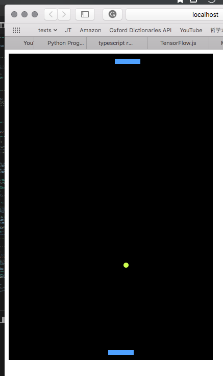

# tf-pong
Sample project for my future reference.

## How to run
1. `$ npm install`
  Install the necessary packages including webpack
2. `$ npm audit fix`
  In case some of the packages have gone highly vulnerable
3. `$ npm run-script start`
  Enjoy!

## Config Files
### package.json ([of npm](https://docs.npmjs.com/files/package.json))
* main: dist/bundle.js
* scripts: dev, build, watch, prod, start (run by [npm run-script <stage>](https://docs.npmjs.com/misc/scripts))
* devDependencies
* dependencies

### package-lock.json ([of npm](https://docs.npmjs.com/files/package-lock.json))
* Package list with exact versions

### tsconfig.json ([of ts-loader](https://github.com/TypeStrong/ts-loader))
* compilerOptions
  * baseUrl
  * declaration
  * outDir
  * sourceMap
  * noImplicitAny
  * module
  * target
  * lib
  * jsx
  * moduleResolution
  * rootDir
* include

### webpack.config.js ([of webpack](https://webpack.js.org/concepts/))
* module.exports
  * mode: development
  * entry: ./src/index.ts
  * devServer
    * open
    * hot
    * publicPath
  * devtool: source
  * output
  * resolve: .ts, .tsx, .js, .json
  * module
    * rules
      * { test: /\.tsx?$/, loader: __"ts-loader"__, exclude: '/node_modules/' }
  * plugins: HtmlWebpackPlugin, webpack.HotModuleReplacementPlugin()
